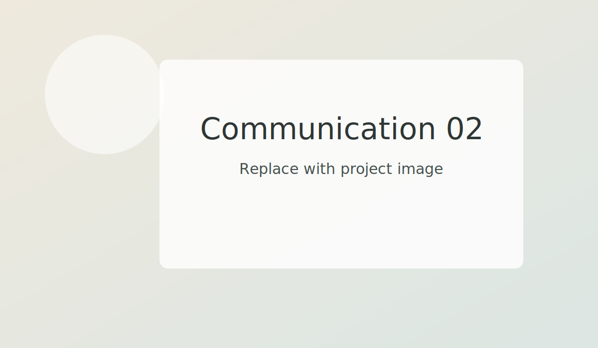

Architectural photography in 2D and immersive 360° formats, dedicated to enhancing and showcasing built spaces.
A sensitive interpretation of atmosphere, light, and materiality.

## Gallery

- 
- 
- 

