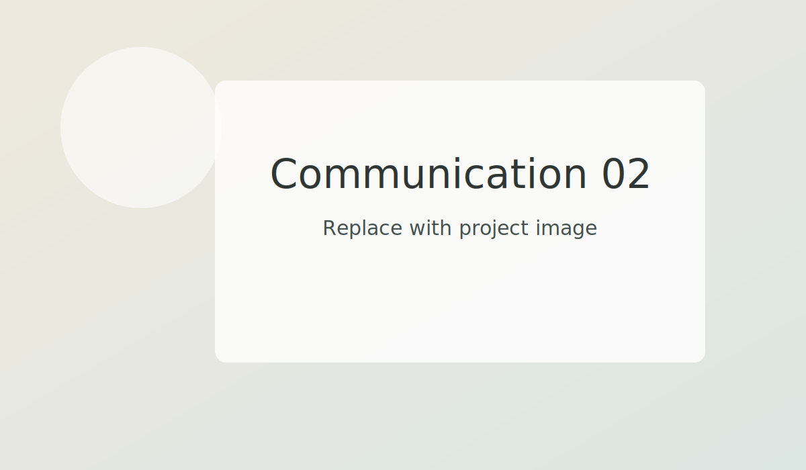

<!-- the #what-we-offer section begins here  -->
<anchor id="what-we-offer"></anchor>

**Immersive Storytelling for Architecture**

We use advanced photographic and immersive technologies to capture the true sensory atmosphere of your buildings. Our process combines:

	•	High-dynamic-range photography

	•	Immersive scans, 2D, or 360° immersive photography

	•	Additional sensorial aspects (sounds, light, etc.) when needed

	•	Sensitive atmosphere description by experts in spatial perception

Our team does more than present a building in a photograph — we interpret its qualities

**What Makes Us Different**

•	Atmospheric and high-quality representation of your photographs

	•	Sensitive interpretation by experts in architectural atmospheres

	•	Immersive experience via 360° environments or refined 2D photography

	•	Seamless integration into your website and digital platforms

	•	We help your clients truly see the space you have designed — without outdated visualization techniques diminishing its impact

<!-- the #ideal-for section begins here  -->
<anchor id="ideal-for"></anchor>

	•	Architects and design studios

	•	Real estate developers

	•	Cultural institutions

	•	Hospitality and wellness spaces

## Gallery

- 
- 
- 

