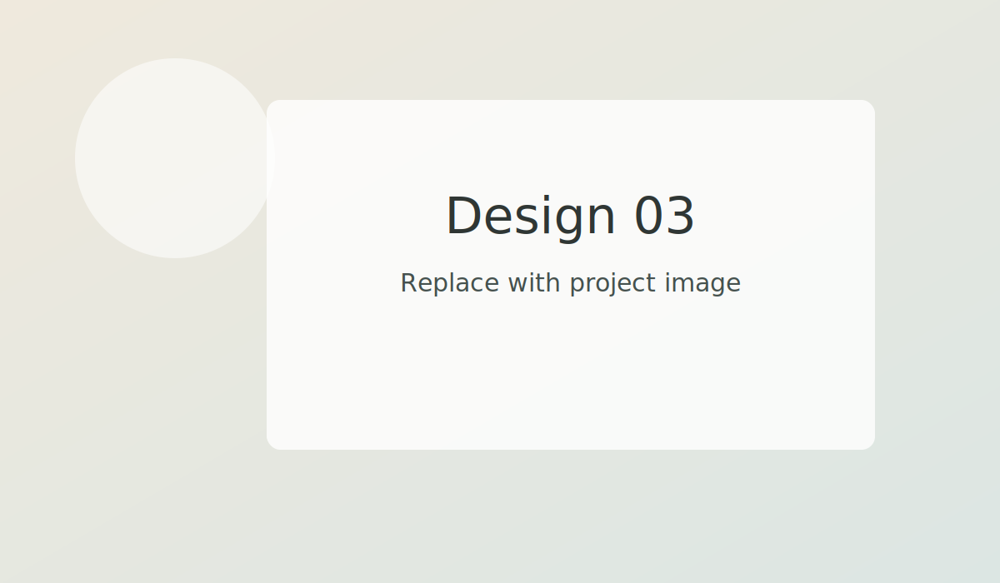

Design turns constraints into choices people can understand and use.

We shape information, drawings, and visual hierarchy so the right details are visible at the right moment.

## Gallery

- 
- 
- 

